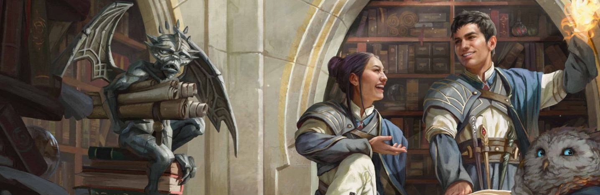

# Make your Character!

  
## Project Concept
```
Based upon the board game Dungeons and Dragons, 
this project was made in order to test and even hone some of my skills in Vuejs.
It's pretty simple, so don't go expecting too much!
```

## Project setup

```
First, you need to install all dependencies. Type **npm install** in your terminal!
It'll install everything it needs.

After the installation is complete, you need to type **npm run serve** to start the server in your localhost, usually :8080. 
In order to serve the database you'll be needing to open another terminal and type **npm run backend**.
After that, you're free to go!
```


```
You'll first see the Home page in which you'll create your sheet!
There's a variety of races and classes to choose from, and you'll even be able to choose what proficiency your character excels at!
I've created one in order to exemplify it.
```

<p align="center">
  
</p>

```
Beware, the Dungeon Master's Realm! 

Here we can see the requested sheets and analyze them in order to repprove, and therefore delete, or approve them! 
The Dungeon Master is also known as the entity behind all the events that surround the story!
```


```
But wait! I'm sure there's someone out there who isn't a complete nerd like me and isn't understanding anything.
No worries! I've made a summary in order to explain some details to bring some context to the table!
If it isn't enough, you can always rely on the Dungeons and Dragons 5E Player's Guidebook to guide you through!
```



